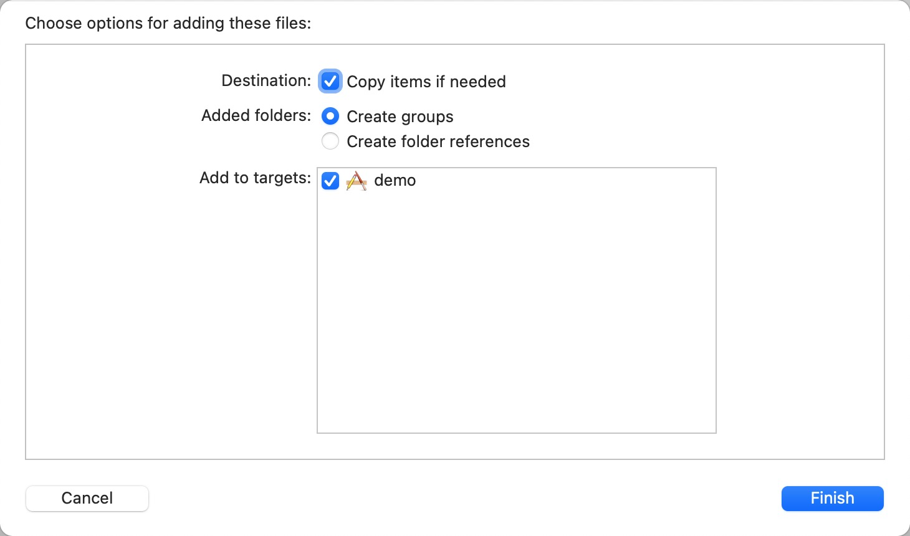
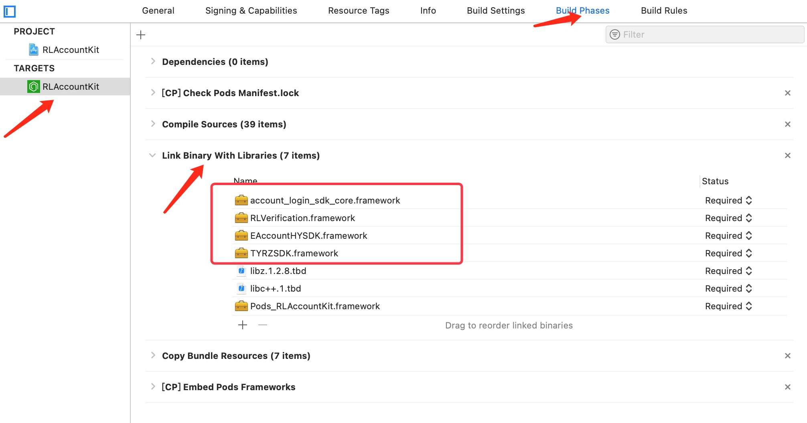
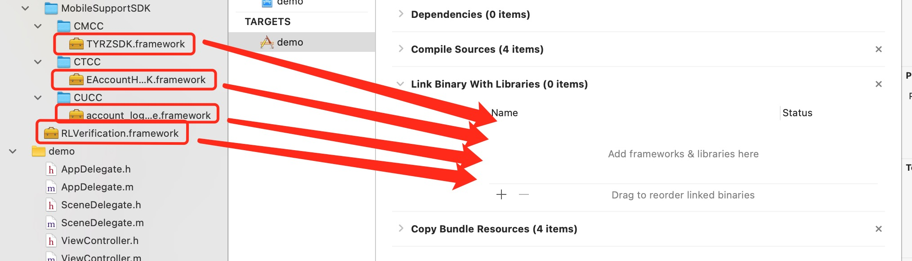
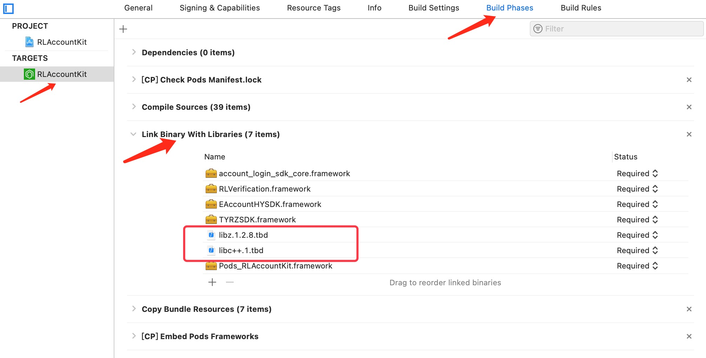
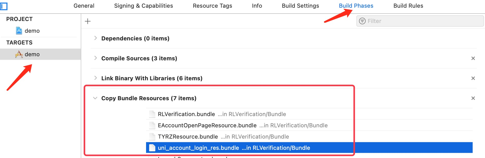
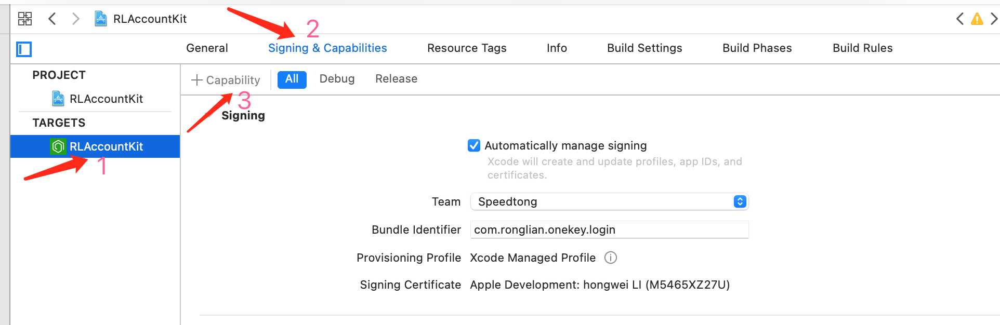
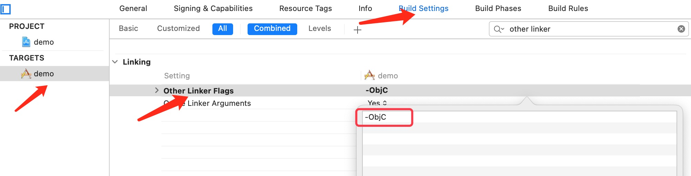

# onekeylogin-ios-demo

# 一. 概述

​		容联云一键登录SDK 为移动应用提供完善的三网（移动、联通、电信）一键登录&号码验证功能开发框架，屏蔽其内部复杂细节，对外提供较为简洁的 API 接口，方便第三方应用快速集成一键登录功能。


SDK包含一键登录和本机号码校验两个不同的功能，使用场景不一样，无需一起使用。

- <font color=#57C3C0 size=3>一键登录服务必须打开蜂窝数据流量并且手机操作系统给予蜂窝数据权限才能使用</font>
  1. 电信只支持4G网络取号
  2. 移动, 联通支持4G, 3G, 2G网络取号，但在非4G网络情况下容易取号失败
- <font color=#57C3C0 size=3>取号请求过程需要消耗用户少量数据流量(国外漫游时可能会产生额外的费用)</font>
- <font color=#57C3C0 size=3>针对双卡双待手机只取当前流量卡号</font>


# 二. Demo快速体验

**克隆/下载本项目到本地，然后执行 ```pod install``` 下载第三方依赖库。**

> **注：**确保已在容联开通并申请了一键登录服务，获取到了相应的AppID。

替换 **_ArgsDefine.h_** 文件中 **_APPID_** 宏的值为申请的appID，并确保 appID 和 bundleID 相对应。

<font color=#brown size=3>如果只是调起授权界面，上面的修改即可。</font>
如果想验证是否能登录成功，则需要自己完善 **NetworkManager.m** 中的以下方法：
```requestMobileLoginQuery: token: completion:```
```requestMobileVerify: token: mobile: completion:```
**或者**根据自己服务器请求自己编写


# 三. 接入SDK的工作配置

当前版本：1.0.3

支持的iOS版本：9.0+

下载SDK后进行解压，解压后包含3个文件(夹)是：

- RLVerification.framework
- MobileSupportSDK
- Bundle


### 1.1 前期准备

- 确保您的终端设备已经开启了4G网络。
- 确保已经在容联开通了一键登录服务并创建了对应的账号。

### 1.2 导包（目前仅支持手动导入）

#### （1）引入文件

步骤：将RLVerification文件夹（包含RLVerification.framework、MobileSupportSDK、Bundle三个子文件）拖入自己的项目目录里，弹出的窗口选择“Copy items if needed”，“Create groups”，“Add to targets”选择你的目标工程。


#### （2）添加静态库

查询工程是否添加了RLVerification.framework、TYRZSDK.framework、EAccountHYSDK.framework、account\_login\_sdk\_core.framework文件。

步骤：点击工程项目，点击目标TARGETS，选择Build Phases，展开Link Binary With Libraries，查看是否存在这四个文件）




如果没有，则需要手动添加（展开添加的SDK文件夹MobileSupportSDK，将其中的framework文件直接拖入即可）


#### （3）添加动态依赖库

>libz.1.2.8.tbd
>
>libc++.1.tbd



#### （4）添加资源文件

添加Bundle文件夹下的几个bundle文件到工程里，否则⼀键登录授权⻚⾯默认的图⽚或icon将会显示不出来。

步骤：点击工程项目，点击目标TARGETS，选择Build Phases，展开Copy Bundle Resources


#### （5）配置支持HTTP传输

> 在Info.plist文件中，新增App Transport Security Settings键，默认类型即可（Dictionary）
>
> 在App Transport Security Settings下新增一项kev-value对
>
> Allow Arbitrary Loads  :  YES

#### （6）使用Apple登录（可选）

在 **iOS13** 中，如果 **App** 提供第三方登录，就必须添加 **苹果登录 Sign in with Apple** 选项，并要求所有开发者于 **2020年4月之前** 完成现有应用的更新，否则审核不给通过。
集成步骤如下：

​	选择项目 TARGETS -> Signing & Capabilities，单击Capability（如下图）

​	在弹出框中搜索Sign in with Apple，双击添加，即可启用Apple 登录

​	最后，登录开发者中心，在需要启用 Sign in with Apple 的 Apple ID中勾选 Sign in with Apple

​	最后更新配置文件即可使用



### 1.3 编译配置

**具体方法：**
点击TARGETS(目标工程名)，点击“Build Settings”，搜索框内搜索Other Linker Flags，在“Other Linker Flags”选项后添加-ObjC，如果项目仍有问题，可以再添加-all_load。




# 四. SDK接口说明

### 4.1 获取单例实例

```objective-c
/** 获取单例实例 */
+ (instancetype)sharedInstance;
```

<font color=red>**注：以下实例方法的调用，都是基于本单例的**</font>


### 4.2 初始化

> 使用一键登录功能前，必须使用开发者自己的 appID 进行初始化SDK
> 建议放在 AppDelegate中的 application: didFinishLaunchingWithOptions: 方法中
> 此方法已默认调用了一次预取号方法

**方法原型：**


```objective-c
/**
 * @param appID     用户在容联平台申请的 应用识别号
 */
- (void)setupWithAppID:(NSString *)appID;

/**
 * 启动初始化
 * @param appID     用户申请的 应用ID
 * @param compHandler   初始化结果回调 YES/NO
 * @param failReason    初始化失败的回调
 */
- (void)setupWithAppID:(NSString *)appID
 withCompletionHandler:(void (^)(BOOL success))compHandler
            failReason:(RLFailReason)failReason;
```

**请求参数**

| 属性        | 类型     | 是否必选 | 说明                               |
| :---------- | :------- | :------- | :--------------------------------- |
| appID       | NSString | 是       | 客户在容联后台申请的子账户ID/AppID |
| compHandler | Block    | 否       | 初始化状态回调                     |
| failReason  | Block    | 否       | 初始化失败回调                     |

**响应参数** 

| 属性    | 类型     | 说明                  |
| :------ | :------- | :-------------------- |
| success | BOOL     | 初始化成功/失败的标识 |
| result  | RLResult | 初始化失败原因        |

**<font color='red'>注解</font>**

- RLFailReason

> /** 失败原因回调Block */
> typedef void (^RLFailReason)(RLResult *result);

- RLResult

| 属性    | 类型     | 说明       |
| :------ | :------- | :--------- |
| code    | NSString | 状态码     |
| message | NSString | 状态码描述 |


**示例代码：**

```objective-c
- (BOOL)application:(UIApplication *)application didFinishLaunchingWithOptions:(NSDictionary *)launchOptions {
    // 设置debug模式（可以打印更多debug信息，务必在发布时候关闭）
    [RLVerification sharedInstance].debug = YES;
    // 容联一键登录SDK初始化
    [[RLVerification sharedInstance] setupWithAppID:APPID];
    
    // coding ...

    [self.window makeKeyAndVisible];
    
    return YES;
}
```


### 4.3 预取号

> 验证当前运营商网络是否可以进行一键登录操作，该方法会缓存取号信息，提高一键登录效率。建议发起一键登录前先调用此方法（SDK在使用 setupWithAppID: 方法初始化时，已调用了一次）

**方法原型：**

```objective-c
/**
 * 一键登录预取号
 *
 * @param listener		预取号结果回调Block，信息用 RLResultModel 存放
 * @param failReason	失败结果回调
 */
- (void)getAccessCode2Login:(RLResultBlock)listener
                 failReason:(RLFailReason)failReason;

```

**请求参数**

| 属性       | 类型  | 说明           |
| :--------- | :---- | :------------- |
| listener   | Block | 初始化状态回调 |
| failReason | Block | 初始化失败回调 |

**响应参数** 

| 属性     | 类型          | 说明               |
| :------- | :------------ | :----------------- |
| rlResult | RLResultModel | 预取号结果回调     |
| result   | RLResult      | 预取号失败原因回调 |

**<font color='red'>注解</font>**

- RLResultBlock

> /** 结果 回调Block*/
> typedef void (^RLResultBlock)(RLResultModel *rlResult);

- RLFailReason

> /** 失败原因回调Block */
> typedef void (^RLFailReason)(RLResult *result);

- RLResult

| 属性    | 类型     | 说明       |
| :------ | :------- | :--------- |
| code    | NSString | 状态码     |
| message | NSString | 状态码描述 |

- RLResultModel

| 属性         | 类型      | 说明                                                   |
| :----------- | :-------- | :----------------------------------------------------- |
| result       | RLResult  | 状态码及描述的模型                                     |
| traceId      | NSString  | 流水号                                                 |
| token        | NSString  | 已经拼好的token/临时凭证                               |
| *mobile*     | NSString  | *手机号*                                               |
| accessCode   | NSString  | 访问码                                                 |
| operatorType | NSString  | 运行商类型（"CM" -- 移动；"CU" -- 联通；"CT" -- 电信） |
| *expires*    | NSInteger | *过期时间*                                             |
| authCode     | NSString  | 授权码（只有电信使用）                                 |
| *openId*     | NSString  | *openId（只有移动使用）*                               |


### 4.4 拉起授权页 - 全屏

> 如果需要自定义UI，需要在调用授权页之前设置
>
> 具体设置请参照 本页 - 授权页面设计条目
>
> **由于没有自动关闭授权页，所以使用完毕需要主动调用 关闭授权页 方法**

```objective-c
/**
 * 一键登录-全屏
 *
 * @param listener  	登录结果回调Block，信息用 RLResult 存放
 * @param failReason	失败结果回调，失败原因 + 失败状态码
 */
- (void)doLogin:(RLResultBlock)listener
     failReason:(RLFailReason)failReason;

```

**请求参数**

| 属性       | 类型  | 说明           |
| :--------- | :---- | :------------- |
| listener   | Block | 初始化状态回调 |
| failReason | Block | 初始化失败回调 |

**响应参数** 

| 属性     | 类型          | 说明               |
| :------- | :------------ | :----------------- |
| rlResult | RLResultModel | 预取号结果回调     |
| result   | RLResult      | 预取号失败原因回调 |

**示例代码：**

```objective-c
/// 一键登录 全屏
- (void)oneKeyLoginWithFullScreen {
   __weak typeof(self) weakSelf = self;
   
    // 初始化默认UI配置
    RLUIConfig *config = [[RLUIConfig alloc] init];
    // 需要定制化 在这里调整参数
    [RLVerification sharedInstance].uiConfig = config;
    
    [[RLVerification sharedInstance] doLogin:^(RLResult *rlResult) {
        NSString *token = rlResult.token;
        NSLog(@"%@", rlResult.description);
    } failReason:^(NSString * _Nonnull reason, NSString * _Nonnull code) {
        NSLog(@"%@, %@", code, reason);
    }];
}
```


### 4.5 拉起授权页 - 弹窗

> 如果需要自定义UI，需要在调用授权页之前设置
>
> 具体设置请参照 本页 - 授权页面设计条目
>
> **由于没有自动关闭授权页，所以使用完毕需要主动调用 关闭授权页 方法**

```objective-c
/**
 * 一键登录-弹窗
 *
 * @param listener  验证结果回调Block，信息用 RLResult 存放
 * @param failReason    失败结果回调，失败原因 + 失败状态码
 */
- (void)doLoginPopup:(RLResultBlock)listener
          failReason:(RLFailReason)failReason;
```

**请求参数**

| 属性       | 类型  | 说明           |
| :--------- | :---- | :------------- |
| listener   | Block | 初始化状态回调 |
| failReason | Block | 初始化失败回调 |

**响应参数** 

| 属性     | 类型          | 说明               |
| :------- | :------------ | :----------------- |
| rlResult | RLResultModel | 预取号结果回调     |
| result   | RLResult      | 预取号失败原因回调 |


### 4.6 退出授权页

```objective-c
/**
 * 关闭一键登录页面
 *
 * @param completion    关闭后回调
 */
- (void)dismissLoginWithCompletion:(void (^ __nullable)(void))completion;
```

**请求参数**

| 属性       | 类型  | 说明           |
| :--------- | :---- | :------------- |
| completion | Block | 关闭授权页回调 |

**示例代码**

```objective-c
/// 一键登录全屏
- (void) oneKeyLoginWithFullScreen {
    __weak typeof(self) weakSelf = self;
    RLUIConfig *config = [self setupCustomUI];
    [RLVerification sharedInstance].uiConfig = config;
    
    [[RLVerification sharedInstance] doLogin:^(RLResult *rlResult) {
        NSString *token = rlResult.token;
        NSLog(@"%@", rlResult.description);
        // APP向服务器请求
        [[NetworkManager sharedInstance] requestMobileLoginQuery:nil token:token completion:^(NSDictionary * _Nonnull data) {
            if ([data[@"statusCode"] isEqualToString:REQUEST_SUCCESS]) {
//                NSString* mobile = data[@"mobile"];
                // APP服务端匹配
                [[RLVerification sharedInstance] dismissLoginWithCompletion:^{
                    NSLog(@"登录成功，退出授权页");
                }];
            } else {
                NSLog(@"登录失败，退出授权页");
            }
        }];
    } failReason:^(NSString * _Nonnull reason, NSString * _Nonnull code) {
        NSLog(@"请求服务器出错，原因是：%@", reason);
    }];
}
```


### 4.7 授权页其他点击事件

> // LoginViewController.h
>
> // 需要遵循 RLVerificationDelegate 中的 协议
>
> @interface LoginViewController () <RLVerificationDelegate>
>
> @end
>
> // LoginViewController.m
>
> // 设置 代理
>
> RLVerification.sharedInstance.delegate = self;

#### **使用方法如下：**


```objective-c
// LoginViewController.m

#pragma mark - RLVerificationDelegate
/**
 * 用户点击了授权页面的返回按钮
 */
- (void)userDidDismissAuthViewController {
    NSLog(@"点击 - 返回");
}

/**
 * 用户点击了授权页面的"切换账户"按钮
 */
- (void)userDidSwitchAccount {
    NSLog(@"点击 - 切换登录方式");
}
/**
 * 一键登录 - 用户点击了授权页面的"第三方"按钮
 */
- (void)userDidThirdPartyWithIndex:(NSInteger)index {
    NSLog(@"点击 - 第三方登录方式\n这次点击的是第%zd个按钮", index);
}
```


### 4.8 本机号码验证

```objective-c
/**
 * 手机号认证
 *
 * @param mobile    需要被验证的手机号
 * @param listener  验证结果回调Block，信息用 RLResult 存放
 * @param failReason    失败结果回调，失败原因 + 失败状态码
 */
- (void)mobileAuthWithMobile:(NSString *)mobile
                    listener:(RLResultBlock)listener
                  failReason:(RLFailReason)failReason;
```

**请求参数**

| 属性       | 类型     | 是否必选 | 说明               |
| :--------- | :------- | :------- | :----------------- |
| mobile     | NSString | 是       | 需要被验证的手机号 |
| listener   | Block    | 否       | 认证结果回调       |
| failReason | Block    | 否       | 认证失败回调       |

**响应参数** 

| 属性     | 类型          | 说明               |
| :------- | :------------ | :----------------- |
| rlResult | RLResultModel | 预取号结果回调     |
| result   | RLResult      | 预取号失败原因回调 |

**示例代码**

```objective-c
- (void)checkDeviceNumber {
    NSString *pNum = <#获取到的手机号#>;
    // 检查手机号合法性
    if (![self isPhoneNum:pNum]) {
        NSLog(@"手机号不正确!");
        return;
    }

    __weak typeof(self) weakSelf = self;
    [[RLVerification sharedInstance] mobileAuthWithMobile:pNum listener:^(RLResult *rlResult) {
        NSString *token = rlResult.token;
        NSLog(@"-------- %@", rlResult.description);
        
        // coding：用 输入的手机号 和 获取到的token 向App后台验证手机号一致性

    } failReason:^(NSString * _Nonnull reason, NSString * _Nonnull code) {
        NSLog(@"请求失败：%@", reason);
    }];
}
```


### 4.9 其他SDK方法

> RLUIConfig.h

```objective-c
// 检查设置的值的合法性
// 如果设置的值不合法，则会替换为默认值
- (RLUIConfig *)checkConfig;
```

> RLVerification.h

```objective-c
/**
 * 超时时间设置：单位 s
 *
 * ❗️❗️❗️如果需要设置，请在 调用初始化方法 setupWithAppID: 之前设置
 */
@property (nonatomic, assign) NSTimeInterval timeoutInterval;

/**
 * 是否初始化成功的标志
 *
 * 如果想重新初始化，将其置为 NO 后，再调用 setupWithAppID: 方法
 */
@property (nonatomic, assign) BOOL isSDKInitSucceeded;

/** 设置debug模式 输出日志 */
@property(nonatomic, assign) BOOL debug;

/** 获取设备型号 */
+ (NSString *)getCurrentDeviceModel;
```


# 五. 授权页面设计

- ### <font color=red>登录按钮文字描述必须包含 “**登录**” 或 “**注册**” 等文字，不得诱导用户授权。</font>

- ### <font color=red>开发者不得通过任何技术手段将授权页面的隐私协议栏、slogan隐藏或者覆盖。</font>

- ### <font color=red>对于接入容联一键登录SDK并上线的应用，我方会对上线的应用授权页面做审查，如果发现未按要求设计授权页面，将关闭应用的一键登录服务。</font>


#### 需要在调起 一键登录全屏/弹窗 之前设置自定义UI

> // 初始化默认界面UI
>
> RLUIConfig *config = [[RLUIConfig alloc] init];
>
> // 自定义：调整需要自定义的参数
>
> // coding ...
>
> RLVerification.sharedInstance.uiConfig = config;


#### 所有可配置参数如下（都在 RLUIConfig.h 中定义）


##### Navigation/导航

| 属性          | 类型     | 描述               | 默认值        |
| :------------ | -------- | ------------------ | ------------- |
| navText       | NSString | 导航栏标题         | 一键登录      |
| navTextSize   | CGFloat  | 导航栏标题字体大小 | 18            |
| navTextColor  | UIColor  | 导航栏标题颜色     | blackColor    |
| naviBgColor   | UIColor  | 导航栏背景颜色     | whiteColor    |
| naviBackImage | UIImage  | 导航栏返回按钮图片 | rl_login_back |

```objective-c
#pragma mark - Navigation/导航
/**
 导航栏标题
 默认：一键登录
 */
@property (nonatomic, strong) NSString *navText;
/**
 导航栏标题字体大小
 默认：18
 */
@property (nonatomic, assign) CGFloat navTextSize;
/**
 导航栏标题颜色
 默认：黑色
 */
@property (nonatomic, strong) UIColor *navTextColor;
/**
 授权页导航的背景颜色
 默认：白色
 */
@property (nullable, nonatomic, strong) UIColor *naviBgColor;
/**
 授权页导航左边的返回按钮的图片
 默认黑色系统样式返回图片
 */
@property (nullable, nonatomic, strong) UIImage *naviBackImage;
```


##### Logo/图标

| 属性           | 类型     | 描述                                               | 默认值             |
| :------------- | -------- | -------------------------------------------------- | ------------------ |
| logoImage      | UIImage  | logo图片                                           | "容联·云通讯" 图标 |
| logoOffsetY    | CGFloat  | LOGO图片相对于屏幕顶部的偏移量（下面的OffssetY同） | 40                 |
| logoWidth      | CGFloat  | logo图片宽度                                       | 250                |
| logoHeight     | CGFloat  | logo图片高度                                       | 50                 |
| ~~logoHidden~~ | ~~BOOL~~ | ~~是否隐藏logo图片~~                               | ~~NO~~             |

```objective-c
#pragma mark - Logo/图标
/**
 授权页面上展示的图标。
 默认为 "容联·云通讯" 图标
 */
@property (nullable, nonatomic, strong) UIImage *logoImage;
/**
 LOGO图片Y偏移量
 该控件顶部（top）相对于屏幕（safeArea）的顶部（top）的距离 （下同）
 默认：40
 */
@property (nonatomic, assign) CGFloat logoOffsetY;
/**
 LOGO宽度
 默认：250
 */
@property (nonatomic, assign) CGFloat logoWidth;
/**
 LOGO高度
 默认：50
 */
@property (nonatomic, assign) CGFloat logoHeight;
/**
 Logo 图片隐藏
 默认：NO，不隐藏
 */
@property (nonatomic, assign) BOOL logoHidden;
```


##### 号码框

| 属性           | 类型    | 描述           | 默认值        |
| -------------- | ------- | -------------- | ------------- |
| numberOffsetY  | CGFloat | 号码框Y偏移量  | 100           |
| numberColor    | UIColor | 号码框字体颜色 | darkTextColor |
| numberTextSize | CGFloat | 号码框字体大小 | 26            |

```objective-c
#pragma mark - 号码框设置
/**
 号码框字体颜色
 默认：darkTextColor
 */
@property (nonatomic, strong) UIColor *numberColor;
/**
 号码框字体大小
 默认：26
 */
@property (nonatomic, assign) CGFloat numberTextSize;
/**
 号码框Y偏移量
 默认：100
 */
@property (nonatomic, assign) CGFloat numberOffsetY;
```


##### Slogan/标语

| 属性            | 类型    | 描述                   | 默认值         |
| --------------- | ------- | ---------------------- | -------------- |
| sloganOffsetY   | CGFloat | Slogan（标语） Y偏移量 | 160            |
| sloganTextColor | UIColor | Slogan 文字颜色        | lightGrayColor |
| sloganTextSize  | CGFloat | Slogan字体大小         | 12             |

```objective-c
#pragma mark - Slogan
/**
 Slogan（标语） Y偏移量
 默认：160
*/
@property (nonatomic, assign) CGFloat sloganOffsetY;
/**
 Slogan 文字颜色
 默认：lightGrayColor
 */
@property (nonatomic, strong) UIColor *sloganTextColor;
/**
 Slogan字体
 默认字体 12
 */
@property (nonatomic, assign) CGFloat sloganTextSize;
```


##### 登录按钮

| 属性                | 类型               | 描述                         | 默认值                                                       |
| ------------------- | ------------------ | ---------------------------- | ------------------------------------------------------------ |
| authButtonText      | NSString           | 登录按钮文本                 | 一键登录                                                     |
| authButtonTextColor | UIColor            | 登录按钮文本颜色             | whiteColor                                                   |
| authButtonTextSize  | CGFloat            | 登录按钮字体大小             | 18                                                           |
| authButtonWidth     | CGFloat            | 登录按钮宽度                 | 280                                                          |
| authButtonHeight    | CGFloat            | 登录按钮高度                 | 46                                                           |
| authButtonOffsetY   | CGFloat            | 登录按钮 Y偏移量             | 230                                                          |
| authButtonImages    | NSArray<UIImage *> | 授权页认证按钮的背景图片数组 | 顺序为：@[正常状态的背景图片, 不可用状态的背景图片, 高亮状态的背景图片]。<br/> 默认正常状态为蓝色，不可用状态的背景图片时为灰色，高亮状态为灰蓝色。 |

```objective-c
#pragma mark - 一键登录按钮设置
/**
 登录按钮文本
 默认：一键登录
*/
@property (nonatomic, strong) NSString *authButtonText;
/**
 登录按钮文本颜色
 默认：白色
*/
@property (nonatomic, strong) UIColor *authButtonTextColor;
/**
 登录按钮字体大小
 默认：18
*/
@property (nonatomic, assign) CGFloat authButtonTextSize;
/**
 登录按钮宽度
 默认：280
*/
@property (nonatomic, assign) CGFloat authButtonWidth;
/**
 登录按钮高度
 默认：46
*/
@property (nonatomic, assign) CGFloat authButtonHeight;
/**
 登录按钮 Y偏移量
 默认：230
*/
@property (nonatomic, assign) CGFloat authButtonOffsetY;
/**
 授权页认证按钮的背景图片数组， @[正常状态的背景图片, 不可用状态的背景图片, 高亮状态的背景图片]。
 默认正常状态为蓝色纯色，不可用状态的背景图片时为灰色，高亮状态为灰蓝色。
*/
@property (nullable, nonatomic, strong) NSArray<UIImage *> *authButtonImages;
```


##### 其他登录方式按钮

| 属性                | 类型     | 描述                   | 默认值          |
| ------------------- | -------- | ---------------------- | --------------- |
| switchButtonText    | NSString | 切换账号按钮的文案     | 其他登录方式    |
| switchButtonColor   | UIColor  | 切换账号按钮的颜色     | systemBlueColor |
| switchButtonSize    | CGFloat  | 切换账号按钮的字体大小 | 15              |
| switchButtonOffsetY | CGFloat  | 切换账号按钮 Y偏移量   | 285             |
| switchButtonHidden  | BOOL     | 切换账号按钮是否隐藏   | NO              |

```objective-c
#pragma mark - Switch Button/切换按钮
/**
 授权页切换账号按钮的文案
 默认：其他登录方式
 */
@property (nullable, nonatomic, copy) NSString *switchButtonText;

/**
 授权页切换账号按钮的颜色
 默认：systemBlueColor
 */
@property (nullable, nonatomic, strong) UIColor *switchButtonColor;

/**
 授权页切换账号的字体
 默认：15
 */
@property (nonatomic, assign) CGFloat switchButtonSize;

/**
 授权页切换账号按钮 Y偏移量
 默认：285
 */
@property (nonatomic, assign) CGFloat switchButtonOffsetY;

/**
 切换账号按钮隐藏状态
 默认：不隐藏
 */
@property (nonatomic, assign) BOOL switchButtonHidden;
```


##### 第三方登录方式

| 属性             | 类型 | 描述                      | 默认值 |
| ---------------- | ---- | ------------------------- | ------ |
| thirdpartyHidden | BOOL | 第三方登录 按钮组是否隐藏 | NO     |

```objective-c
#pragma mark - 第三方登录方式：默认居中
/*
 第三方登录 按钮 隐藏状态
 默认：NO，不隐藏
 */
@property (nonatomic, assign) BOOL thirdpartyHidden;
```


##### 隐私条款

| 属性                          | 类型     | 描述                                | 默认值                                   |
| ----------------------------- | -------- | ----------------------------------- | ---------------------------------------- |
| privacyCheckedBoxSize         | CGSize   | 条款勾选框大小                      | {16, 16}                                 |
| privacyCheckedBoxDefaultState | BOOL     | 勾选框默认状态                      | NO，不勾选                               |
| privacyCheckedImage           | UIImage  | 勾选框勾选状态的图标                | 蓝色图标，推荐尺寸为12x12                |
| privacyUncheckedImage         | UIImage  | 勾选框未勾选状态的图标              | 白色图标，推荐尺寸为12x12                |
|                               |          |                                     |                                          |
| privacyMobileNameColor        | UIColor  | 运营商隐私协议名称的颜色            | systemGreenColor                         |
| privacyOtherTextColor         | UIColor  | 除了运营商&合作商外，其他文字的颜色 | lightGrayColor                           |
| privacyPartnerLabelText       | NSString | 合作方用户协议文字                  | 《用户协议》                             |
| privacyPartnerUrl             | NSString | 合作方用户协议URL                   | https://www.apple.com/legal/privacy/szh/ |
| privacyLabelBottomOffsetY     | CGFloat  | 隐私协议标签相对于屏幕底部的Y偏移量 | 10                                       |
| privacyLabelTextSize          | CGFloat  | 隐私协议标签字体大小                | 12                                       |

```objective-c
#pragma mark - 隐私条款设置
/**
 授权页面上条款勾选框大小
 默认：16x16
*/
@property (nonatomic, assign) CGSize privacyCheckedBoxSize;
/**
 授权页面上勾选框默认状态
 默认：NO，不选中
*/
@property (nonatomic, assign) BOOL privacyCheckedBoxDefaultState;
/**
 授权页面上勾选框勾选的图标
 默认为蓝色图标，推荐尺寸为12x12
*/
@property (nullable, nonatomic, strong) UIImage *privacyCheckedImage;
/**
 授权页面上勾选框未勾选的图标
 默认为白色图标，推荐尺寸为12x12
*/
@property (nullable, nonatomic, strong) UIImage *privacyUncheckedImage;
/**
 授权页面上运营商隐私协议名称的颜色
 默认：systemGreenColor
*/
@property (nonatomic, strong) UIColor *privacyMobileNameColor;
/**
 授权页面上除了运营商&合作商外，其他文字的颜色
 默认：lightGrayColor
 */
@property (nonatomic, strong) UIColor *privacyOtherTextColor;
/**
 授权页面上合作方用户协议文字
 默认：《用户协议》
*/
@property (nonatomic, strong) NSString *privacyPartnerLabelText;
/**
 授权页面上合作方用户协议URL
 默认：https://www.apple.com/legal/privacy/szh/
*/
@property (nonatomic, strong) NSString *privacyPartnerUrl;
/**
 授权页面上隐私协议标签Y偏移量
 授权页面上该控件底部（bottom）相对于屏幕（safeArea）底部（bottom）的距离
 默认：10
*/
@property (nonatomic, assign) CGFloat privacyLabelBottomOffsetY;
/**
 授权页面上隐私协议标签字体大小
 默认：12
*/
@property (nonatomic, assign) CGFloat privacyLabelTextSize;
```


##### 弹窗

| 属性    | 类型 | 描述           | 默认值 |
| ------- | ---- | -------------- | ------ |
| isPopup | BOOL | 是否为弹窗模式 | NO     |

```objective-c
#pragma mark - 弹窗设置
/**
 是否为弹窗模式
 默认：NO
*/
@property (nonatomic, assign) BOOL isPopup;
```


##### WebView

| 属性             | 类型     | 描述                          | 默认值   |
| ---------------- | -------- | ----------------------------- | -------- |
| webNaviTitleText | NSString | 条款内容WebView中的导航栏标题 | 用户协议 |

```objective-c
#pragma mark - WebViewController Navigation/服务条款页面导航栏
/**
 服务条款页面导航的标题
 默认："用户协议"
 */
@property (nullable, nonatomic, strong) NSString *webNaviTitleText;
```


**界面说明**


# 六. 常见问题

##### 1. 出现 找不到方法的报错

> -[UIImageView _isDecompressing]: unrecognized selector sent to instance 0x15122c530
>
> -[UIImageView _isSymbolImage]: unrecognized selector sent to instance 0x15122c530
>
> 等

**解决方案：**
a. 注意导包方式，应该用 **Create groups**，不要用 Create folder references
b. 查找路径：targets -> Build Settings -> Other Linker Flags
  添加 -ObjC（如果仍然出现unrecognized selector sent to instance找不到方法的报错，则再添加-all_load）

附加： 一些其他编译问题，可以尝试在 targets -> Build Settings -> Other Linker Flags 中加上以下配置

> \$(inherited)
>
> -framework
>
> "ImageIO"
>
> -lstdc++
>
> -force_load
>
> \$(PROJECT_DIR)/RLVerification/MobileSupportSDK/CMCC/TYRZSDK.framework/TYRZSDK
>
> -force_load
>
> \$(PROJECT_DIR)/RLVerification/MobileSupportSDK/CTCC/EAccountHYSDK.framework/EAccountHYSDK
>
> -force_load
>
> \$(PROJECT_DIR)/RLVerification/RLVerification.framework/RLVerification
>
> >**注：SDK路径根据自己文件的实际路径进行设置**

##### 2. 授权界面显示异常（不显示默认图片）

**解决方案：**
查找路径：TARGETS-->Build Phases-->Copy Bundle Resources
添加以下bundle资源文件

> RLVerification.bundle
>
> EAccountOpenPageResource.bundle
>
> TYRZResource.bundle
>
> uni\_account\_login\_res.bundle

##### 3. SignInWithAppleID相关的错误

> Error Domain=com.apple.AuthenticationServices.AuthorizationError Code=1001 "(null)"
> Authorization failed: Error Domain=AKAuthenticationError Code=-7003 "(null)" UserInfo={AKClientBundleID=bundleid}
> ...

**原因**
	使用苹果登录，但是项目配置中未添加 Sign in with Apple

**解决方案：**

详见 1.2（6）


# 七. 状态码

> <font color=red>000</font>xxx，<font color=red>11/12/13/59</font>xxxx
>
> 见 容联状态码


> <font color=red>其他</font>，见
>
> 运营商状态码

